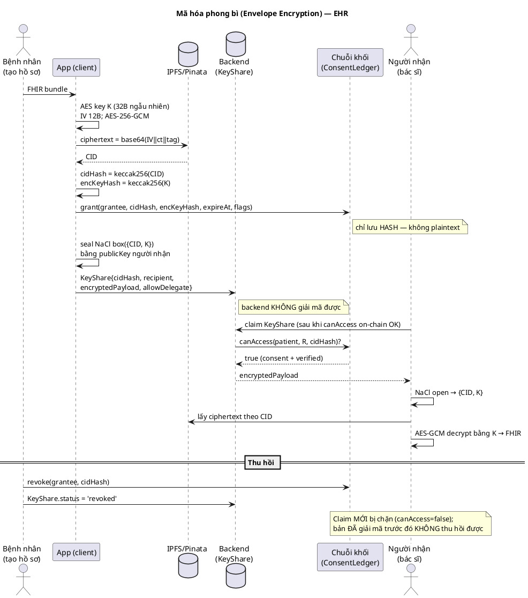

# 34 — Nội dung báo cáo SẴN-ĐỂ-DÁN (chặng cuối)

> Trả lời 11 nhận xét của thầy bằng **nội dung dán thẳng vào Quyển** (bảng markdown → chuyển LaTeX; PlantUML → `Bao Cao/figures/`). KHÔNG sửa `Bao Cao/*.tex` ở đây (gitignored, không backup — owner tự dán). Mọi số liệu đã verify từ code phiên 2026-06-23 (RULE #0). Dùng kèm [33](33_final_push_checklist.md).

---

## #3 — Bằng chứng test cascade (ĐÃ XONG, PASS)
Trích vào mục kiểm thử:
- **Property test** `contracts/test/ConsentLedgerCascadeProperty.t.sol` — 5/5 PASS:
  - `test_Scenario_RevokeRoot_KillsChain_KeepsDirect` (BN→A→B; B cấp C qua chain + BN cấp C trực tiếp; revoke A → chain chết, direct sống).
  - `test_Scenario_ABC_RevokeRoot_KillsChain_KeepsDirectToC` (**đúng chữ thầy**: BN→A→B→C + BN→C trực tiếp; revoke A → cả chuỗi chết, direct C sống).
  - `testFuzz_DeepChain_RevokeRoot_KillsLeaf` (256 runs, chuỗi 1–6 hop).
  - `testFuzz_DirectGrantImmuneToCascade` (256 runs).
  - `test_F1_DirectGrantOverBulkKey_SurvivesDelegationRevoke` (regression F1).
- **Invariant test** `ConsentLedgerCascadeInvariant.t.sol` — PASS: **128,000 calls, 0 reverts**, bất biến "DIRECT consent không bao giờ bị cascade revoke xoá" dưới churn ngẫu nhiên (grant/subDelegate/revoke).
- Cơ chế: `delegationEpoch[patient][delegator]` bump mỗi lần revoke; downstream consent so epoch trong `canAccess` (MAX_DELEGATION_WALK=8); consent trực tiếp có `delegationParent=address(0)` nên không nằm trong đường cascade.

---

## #2 — Bảng 5 hợp đồng
| Contract (lines) | Trách nhiệm | State chính | Event chính | Hàm public quan trọng | Ai gọi | Revert |
|---|---|---|---|---|---|---|
| **AccessControl** (529) | Role bitwise + verify bác sĩ + registry tổ chức | `_roles`, `organizations`, `adminToOrgId`, `doctorVerifications`, `MINISTRY_OF_HEALTH` | `DoctorVerified`, `VerificationRevoked`, `OrganizationCreated`, `OrganizationStatusChanged` | `verifyDoctor`, `verifyDoctorByMinistry`, `revokeDoctorVerification`, `createOrganization`, `isVerifiedDoctor`, `setRelayer` | org admin / ministry | `NotAuthorized` |
| **RecordRegistry** (330) | Lưu `cidHash` + chuỗi cha-con | `records`, `parentOf` | `RecordAdded`, `RecordUpdated` | `addRecord`, `getOwnerRecords`, `parentOf`, `setConsentLedger`, `authorizeContract` | patient / contract uỷ quyền (DoctorUpdate) | `NotAuthorized`, `MaxVersionReached` |
| **ConsentLedger** (650) | Consent + delegation CHAIN + EIP-712 + trusted contact | `consents`, `_delegations`, `delegationParent`, `delegationEpoch`, `isTrustedContact`, `nonces`, `accessControl` | `ConsentGranted/Revoked`, `DelegationGranted/Revoked`, `AccessGrantedViaDelegation`, `TrustedContactSet/Revoked` | `grant`/`grantInternal`, `grantBySig`, `delegateAuthorityBySig`, `subDelegate`, `grantUsingDelegation`, `revoke`/`revokeFor`, `revokeDelegation`, `setTrustedContactBySig`, **`canAccess`** | patient (gốc) / delegatee / relayer (BySig) | `DeadlinePassed`, `NotAuthorized`, `InvalidExpire` |
| **DoctorUpdate** (274) | Facade `addRecordByDoctor` | (gọi RecordRegistry/ConsentLedger) | (qua RecordRegistry) | `addRecordByDoctor` (`onlyDoctor` = isDoctor, KHÔNG verified; KHÔNG check consent cha) | bác sĩ | `NotAuthorized` |
| **EHRSystemSecure** (358) | State machine yêu cầu truy cập 2-bên | `requests` | `AccessRequested`, `RequestCompleted`, `RequestRejected` | `requestAccess`, `confirmAccessRequestWithSignature` (primaryType `ConfirmRequest`), `rejectRequestWithSignature` | bác sĩ (request) + bệnh nhân (confirm) | `NotAuthorized` |

## #2 — Bảng invariant (đã test-backed)
| # | Invariant | Cơ chế | Test |
|---|---|---|---|
| I1 | Chỉ **bệnh nhân** cấp/thu hồi consent GỐC | `grant`/`revoke` yêu cầu `msg.sender==patient` (hoặc relayer thay mặt chữ ký bệnh nhân) | ConsentLedgerTest |
| I2 | Bác sĩ chỉ re-share khi `allowDelegate=true` | RecordDelegation set `allowDelegate`; `grantUsingRecordDelegation` check cờ | ConsentLedgerTest |
| I3 | Quyền phái sinh **mất khi gốc bị thu hồi** | `delegationEpoch` bump + so epoch trong `canAccess` | **CascadeProperty/Invariant PASS** |
| I4 | Consent **trực tiếp KHÔNG bị cascade xoá nhầm** | `delegationParent=address(0)` → ngoài đường walk | **CascadeProperty/Invariant 128k calls PASS** |

---

## #11 — Bảng Threat Model (dán mục bảo mật)
| Đe doạ | Tác động | Biện pháp hiện có | Còn lại / giới hạn |
|---|---|---|---|
| Máy chủ độc hại (backend) | Lộ metadata | "Blind mailbox" — chỉ giữ ciphertext + hash; gate `canAccess` on-chain | — |
| Bác sĩ bị thu hồi nhưng đã tải dữ liệu | Giữ bản đã giải mã | revoke chặn truy cập **về sau** (status='revoked' + `canAccess` từ chối) | **Không thu hồi được bản đã copy** (giới hạn nội tại E2EE) |
| Mất thiết bị bệnh nhân | Kẻ khác thao tác | Khoá ví Web3Auth + **gate sinh trắc/PIN thiết bị mỗi lần ký** (bắt buộc, patient/doctor) | Local record mất nếu xoá app (mitigation: self key-share) |
| Người thân tin cậy lạm dụng | Truy cập ngoài bác sĩ | Chỉ BN ký EIP-712 thêm; **log `TRUSTED_CONTACT_CLAIM` + thông báo realtime/push cho BN**; chỉ định = event on-chain | Chưa TTL khẩn cấp / chưa xác minh danh tính người thân (future) |
| Relayer DoS / từ chối | Không gửi được tx | **Self-pay fallback** (user tự trả gas) + quota 100/tháng + rate-limit | — |
| IPFS/Pinata mất dữ liệu | Mất ciphertext | (gap) | **Chưa pin đa nơi/backup** (future) |
| Replay chữ ký | Phát lại tx ký | **EIP-712 `nonce` + `deadline`**; contract revert `DeadlinePassed` + `nonces[patient]++` | — (đã chặn) |
| Lộ khoá phía client | Mạo danh ký | Khoá chỉ trong RAM phiên, không persist, xoá khi logout/restart | Nếu app bị chèn mã độc (giới hạn self-custody) |
| Tấn công smart contract | Sai phân quyền | modifier/role checks + **140 test** (unit+property+invariant) | Chưa audit chuyên nghiệp bên thứ 3 |

---

## #5 — Bảng "đối chiếu yêu cầu" 3 mức (thay "chứng minh tuân thủ")
| Yêu cầu | Mức | Căn cứ / ghi chú |
|---|---|---|
| Mã hoá DLCN nhạy cảm (E2E) | ✅ Đã hiện thực | AES-256-GCM + NaCl box; NĐ356 Đ12 k4 |
| Chỉ lưu hash/khử nhận dạng on-chain | ✅ Đã hiện thực | `cidHash`/`encKeyHash`; **NĐ356 Đ11 k2b** |
| Phân quyền truy cập + đồng ý | ✅ Đã hiện thực | consent on-chain + `canAccess`; NĐ356 Đ4 k2, Luật91 Đ26 |
| Audit log truy cập | ✅ Đã hiện thực | AccessLog + events on-chain |
| Ký điện tử HSBA (sinh trắc) | ⚠️ Một phần | chữ ký điện tử chuyên dùng + gate sinh trắc/PIN thiết bị; TT13/2025 Đ3.2 (chưa "bảo đảm an toàn"/CA) |
| Xác thực mạnh/đa yếu tố | ⚠️ Một phần | đa yếu tố cấp thiết bị (không per-account); NĐ356 Đ9 k3b chỉ áp "dữ liệu lớn" — **không bắt buộc** với đồ án |
| Lưu trữ HSBA chính thức tại CSKCB | ❌ Ngoài phạm vi | nguyên mẫu, chưa tích hợp HIS bệnh viện |
| Chữ ký số quốc gia (CA) | ❌ Ngoài phạm vi | chưa tích hợp dịch vụ CA |
| FHIR / DICOM | ❌ Ngoài phạm vi | chưa chuẩn hoá |
| Liên thông BHYT | ❌ Ngoài phạm vi | chưa tích hợp |
| Định danh VNeID | ❌ Ngoài phạm vi | NĐ69/2024 — hệ định danh quốc gia, chưa kết nối |

---

## #7 — Relayer chống replay & lạm dụng (đã có trong code)
- **EIP-712 domain**: `name`, `version`, **`chainId` (421614)**, **`verifyingContract`** (địa chỉ ConsentLedger).
- **Nonce chống replay**: `nonces[patient]` — DÙNG CHUNG cho `ConsentPermit`/`DelegationPermit`/`TrustedContactPermit`; mỗi lần submit `nonces[patient]++` ([ConsentLedger.sol:271,428](../contracts/src/ConsentLedger.sol#L271)).
- **Deadline**: mọi permit có `uint256 deadline`; contract revert `DeadlinePassed` nếu `block.timestamp > deadline` ([:249,:405](../contracts/src/ConsentLedger.sol#L249)).
- **Relayer kiểm tra trước khi gửi**: chỉ sponsor được `authorizeSponsor`; **quota 100 chữ ký/tháng/user** (`relayer.service.js`); `express-rate-limit` (`RELAYER_RATELIMIT_*`) — đã wire `trust proxy` cho Render.
- **Relayer down**: **self-pay fallback** (`mobile/src/utils/selfPayFallback.js`) — user tự trả gas.

---

## #1 — Mã hoá phong bì: mô tả + giới hạn + sơ đồ
**Mô tả (verified):** mỗi record → AES-256-GCM, **khoá 32B ngẫu nhiên**, **IV 12B ngẫu nhiên/lần**, output `base64(IV‖ciphertext‖tag)` ([crypto.js:36-56](../mobile/src/services/crypto.js#L36)). Khoá AES được **niêm phong cho từng người nhận** bằng **NaCl box** (X25519) → `KeyShare.encryptedPayload = box({cid, aesKey})`. On-chain chỉ `cidHash + encKeyHash`. **KeyShare fields**: `cidHash, senderAddress, recipientAddress, encryptedPayload, senderPublicKey, allowDelegate, status, createdAt/claimedAt/expiresAt` ([schema.prisma:176](../backend/prisma/schema.prisma#L176)). **Thu hồi**: `status='revoked'` (cascade qua subgraphSync/keyShareWriter, timestamp-guard chống race).
- ⚠️ **AAD hiện = rỗng** → nên thêm `AAD=cidHash` (chống tráo ciphertext) hoặc ghi là hướng phát triển.
- ⚠️ **Giới hạn (BẮT BUỘC nêu):** thu hồi **chỉ chặn truy cập về sau**; KHÔNG "xoá ký ức" — ai đã giải mã + sao chép thì không thu hồi được (giới hạn nội tại của E2EE).

**PlantUML (lưu `Bao Cao/figures/envelope_encryption.puml`):**

---

## #8 — Bằng chứng triển khai (điền vào Quyển)
- **Mạng**: Arbitrum Sepolia (chainId **421614**). Explorer: `https://sepolia.arbiscan.io/address/<addr>`.
- **Địa chỉ contract (LIVE 21/06/2026):**
  - AccessControl `0x9141ff77c1ef3544C29Fa1dAe5c085185b4FAf5A`
  - ConsentLedger `0x13485F54Cd5bC0C3d06D87B118B0369741b509B0`
  - RecordRegistry `0x3d44D8f5438aF5Bc47b88FE289A699743C9Ef53a`
  - EHRSystemSecure `0x8C03A46022C94D82a863BA2E2fb55f6C488708cb`
  - DoctorUpdate `0x83D7Bd3DCC05307Ed130f0F7331606462d1dD17c`
- **Subgraph**: `https://api.studio.thegraph.com/query/120096/ehr/0.3.0`
- **API**: `https://ehr-blockchain-system.onrender.com` (Render, free tier — ghi rõ).
- **APK**: link EAS artifact + QR (bản preview, `@bachnh/ehr-blockchain-mobile`).
- **Chạy local**: `cd backend && npm run dev` + `cd mobile && npm run android` — **KHÔNG dùng Docker Compose** (ghi đúng); có `.env.example` ở backend + mobile.
- 4 tài khoản demo: patient / doctor / org / ministry (điền địa chỉ ví + cách đăng nhập).

---

## #9 — Sửa trích dẫn pháp lý
- **TT 13/2025/TT-BYT** (HSBA điện tử): ban hành **06/06/2025**, hiệu lực **21/07/2025**, Điều 3 = 3 hình thức ký. (nguồn Bộ Y tế neac.gov.vn)
- ❌ **Bỏ "TT 13/2026/TT-BYT"** — 13/2026 là tiêm chủng, KHÔNG phải HSBA → đổi hết thành 13/2025.
- **QĐ 586/QĐ-BYT**: rà lại số/ngày trên vbpl.vn trước khi cite.
- Thêm: **Luật 91/2025/QH15 + NĐ 356/2025/NĐ-CP** (hiệu lực 01/01/2026); ghi **NĐ 13/2023 hết hiệu lực 01/01/2026**. Chi tiết [32](32_legal_updates.md).
