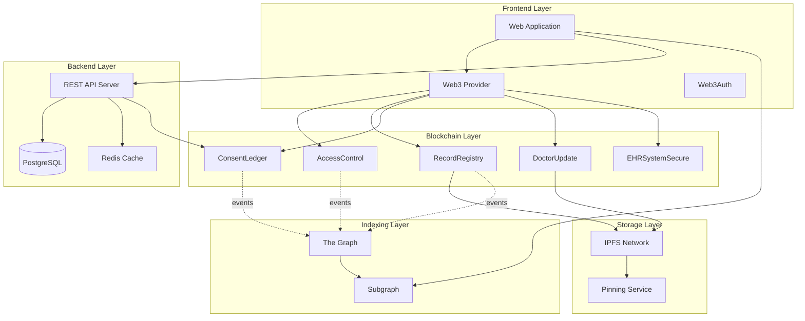
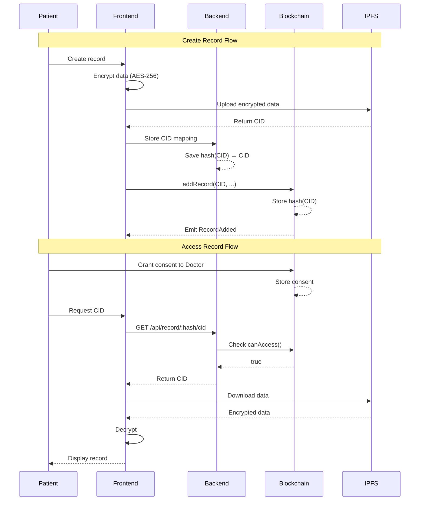

# Architecture - EHR System

## Tổng Quan Kiến Trúc

Hệ thống EHR được thiết kế theo kiến trúc 3 tầng với sự kết hợp giữa blockchain, storage phi tập trung, và backend truyền thống.

---

## 🏗️ Kiến Trúc Tổng Thể



---

## 📦 Các Thành Phần Chính

### 1. Frontend Layer

**Công nghệ:**
- React/Next.js
- ethers.js v6
- Web3Auth
- TailwindCSS

**Chức năng:**
- User interface
- Wallet connection
- Transaction signing
- Data encryption/decryption
- IPFS upload/download

---

### 2. Backend Layer

**Công nghệ:**
- Node.js/Express
- PostgreSQL
- Redis
- JWT authentication

**Chức năng:**
- CID mapping storage
- Access control enforcement
- Audit logging
- API endpoints
- Caching

**Database Schema:**
```sql
-- CID Mapping
CREATE TABLE cid_mappings (
    id SERIAL PRIMARY KEY,
    cid_hash VARCHAR(66) UNIQUE NOT NULL,
    plaintext_cid TEXT NOT NULL,
    owner_address VARCHAR(42) NOT NULL,
    created_at TIMESTAMP DEFAULT NOW(),
    INDEX idx_cid_hash (cid_hash),
    INDEX idx_owner (owner_address)
);

-- Access Logs
CREATE TABLE access_logs (
    id SERIAL PRIMARY KEY,
    cid_hash VARCHAR(66) NOT NULL,
    accessor_address VARCHAR(42) NOT NULL,
    action VARCHAR(50) NOT NULL,
    ip_address INET,
    user_agent TEXT,
    timestamp TIMESTAMP DEFAULT NOW(),
    INDEX idx_cid_hash (cid_hash),
    INDEX idx_accessor (accessor_address)
);
```

---

### 3. Blockchain Layer

**Network:** Arbitrum/Optimism (Ethereum L2)

**Smart Contracts:**

```
┌─────────────────────────────────────────────────┐
│           EHRSystemSecure (Orchestrator)        │
│  - Request/Approve flow                         │
│  - Double confirmation                          │
│  - Pausable                                     │
└────────────┬────────────────────────────────────┘
             │
    ┌────────┼────────┬────────────┐
    │        │        │            │
    ▼        ▼        ▼            ▼
┌────────┐ ┌────────┐ ┌────────┐ ┌────────┐
│Access  │ │Record  │ │Consent │ │Doctor  │
│Control │ │Registry│ │Ledger  │ │Update  │
└────────┘ └────────┘ └────────┘ └────────┘
```

**Contract Relationships:**
- `EHRSystemSecure` orchestrates all operations
- `AccessControl` manages roles
- `RecordRegistry` manages record metadata (hash-only)
- `ConsentLedger` manages access permissions
- `DoctorUpdate` handles doctor-initiated flows

---

### 4. Storage Layer

**IPFS:**
- Decentralized file storage
- Content-addressed (CID)
- Immutable
- Encrypted data

**Pinning Service:**
- Pinata/Web3.Storage
- Ensures data availability
- Redundancy

**Data Structure on IPFS:**
```json
{
  "version": "1.0",
  "encryptedData": "0x...",
  "encryptionAlgorithm": "AES-256-GCM",
  "iv": "0x...",
  "authTag": "0x...",
  "metadata": {
    "recordType": "Lab Result",
    "timestamp": 1234567890,
    "hospital": "General Hospital"
  }
}
```

---

### 5. Indexing Layer

**The Graph:**
- Event indexing
- GraphQL API
- Real-time updates

**Subgraph Schema:**
```graphql
type Record @entity {
  id: ID!
  cidHash: Bytes!
  owner: Bytes!
  createdBy: Bytes!
  createdAt: BigInt!
  recordTypeHash: Bytes!
  version: Int!
}

type Consent @entity {
  id: ID!
  patient: Bytes!
  grantee: Bytes!
  rootCidHash: Bytes!
  issuedAt: BigInt!
  expireAt: BigInt!
  active: Boolean!
}
```

---

## 🔄 Luồng Dữ Liệu Chi Tiết

### Luồng 1: Tạo Hồ Sơ (Patient)

```
1. Patient tạo hồ sơ trên UI
   ↓
2. Frontend mã hóa data với AES-256
   ↓
3. Upload encrypted data lên IPFS
   ↓
4. Nhận CID từ IPFS
   ↓
5. Gửi CID lên Backend
   ↓
6. Backend lưu mapping: hash(CID) → CID
   ↓
7. Frontend gọi RecordRegistry.addRecord(CID, ...)
   ↓
8. Smart contract lưu hash(CID) on-chain
   ↓
9. Emit RecordAdded event
   ↓
10. The Graph index event
```

### Luồng 2: Bác Sĩ Tạo Hồ Sơ

```
1. Doctor tạo hồ sơ cho patient
   ↓
2. Encrypt data với patient's public key
   ↓
3. Upload lên IPFS → CID
   ↓
4. Backend lưu CID mapping
   ↓
5. DoctorUpdate.addRecordByDoctor(CID, patient, ...)
   ↓
6. Tự động grant consent cho:
   - Patient (permanent)
   - Doctor (7 days default)
   ↓
7. Emit events
```

### Luồng 3: Cấp Quyền Truy Cập (Double Confirmation)

```
1. Doctor request access
   ↓
2. EHRSystemSecure.requestAccess(patient, CID, ...)
   ↓
3. Patient nhận notification
   ↓
4. Patient approve request
   ↓
5. EHRSystemSecure.approveRequest(requestId)
   ↓
6. Wait MIN_APPROVAL_DELAY (1 hour)
   ↓
7. Doctor confirm
   ↓
8. EHRSystemSecure.approveRequest(requestId) again
   ↓
9. ConsentLedger.grantInternal() called
   ↓
10. Access granted
```

### Luồng 4: Truy Cập Hồ Sơ

```
1. Doctor request CID từ Backend
   ↓
2. Backend kiểm tra consent on-chain
   ConsentLedger.canAccess(patient, doctor, CID)
   ↓
3. Nếu có quyền:
   Backend trả plaintext CID
   ↓
4. Frontend download từ IPFS
   ↓
5. Decrypt data với private key
   ↓
6. Hiển thị hồ sơ
   ↓
7. Backend log access
```

---

## 🔐 Security Architecture

### Defense in Depth

```
Layer 1: Frontend
├─ Web3Auth authentication
├─ Client-side encryption
└─ Signature verification

Layer 2: Backend
├─ JWT authentication
├─ Rate limiting
├─ IP whitelisting
└─ Audit logging

Layer 3: Blockchain
├─ Access control
├─ Consent verification
├─ Reentrancy protection
└─ Pausable

Layer 4: Storage
├─ IPFS (content-addressed)
├─ AES-256 encryption
└─ Pinning service
```

### Privacy Model

**On-chain (Public):**
- ✅ Only hashes stored
- ✅ No plaintext CID
- ✅ No plaintext data
- ✅ Events emit hashes only

**Off-chain (Private):**
- 🔒 Backend: CID mapping (access controlled)
- 🔒 IPFS: Encrypted medical data
- 🔒 Encryption keys: Patient controlled

---

## 📊 Data Flow Diagram



---

## 🚀 Deployment Architecture

### Development
```
Local Network (Anvil)
├─ Smart Contracts
├─ Local IPFS node
└─ Local Backend
```

### Testnet
```
Arbitrum Sepolia
├─ Deployed Contracts
├─ Pinata IPFS
└─ Staging Backend (AWS)
```

### Production
```
Arbitrum One
├─ Verified Contracts
├─ Pinata + Web3.Storage
└─ Production Backend
    ├─ Load Balancer
    ├─ Multiple instances
    ├─ PostgreSQL (Multi-AZ)
    └─ Redis Cluster
```

---

## 📈 Scalability Considerations

### Blockchain
- L2 solution (Arbitrum) for low gas fees
- Hash-only storage (minimal data)
- Batch operations where possible

### Backend
- Horizontal scaling (multiple instances)
- Database read replicas
- Redis caching
- CDN for static assets

### IPFS
- Multiple pinning services
- Content delivery optimization
- Garbage collection strategy

---

## 🔧 Technology Stack Summary

| Layer | Technology | Purpose |
|-------|-----------|---------|
| Frontend | React, ethers.js | User interface |
| Backend | Node.js, PostgreSQL | CID mapping, API |
| Blockchain | Solidity, Foundry | Smart contracts |
| Storage | IPFS, Pinata | Decentralized storage |
| Indexing | The Graph | Event querying |
| Security | AES-256, EIP-712 | Encryption, signatures |

---

## 📝 Design Principles

1. **Privacy First:** No plaintext data on-chain
2. **Patient Control:** Patients own their data
3. **Decentralization:** No single point of failure
4. **Security:** Multiple layers of protection
5. **Scalability:** L2 + efficient storage
6. **Compliance:** GDPR-compatible architecture
