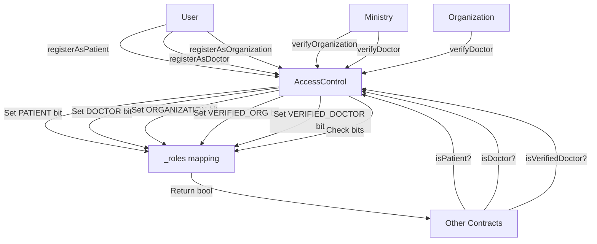

# AccessControl Contract - Hệ Thống Quản Lý Vai Trò

## 📋 Mục Lục
1. [Tổng Quan](#tổng-quan)
2. [Quá Trình Tư Duy Thiết Kế](#quá-trình-tư-duy-thiết-kế)
3. [Kiến Trúc Contract](#kiến-trúc-contract)
4. [Chi Tiết Implementation](#chi-tiết-implementation)
5. [Security Considerations](#security-considerations)
6. [Testing Strategy](#testing-strategy)

---

## Tổng Quan

### Vai Trò Trong Hệ Thống
`AccessControl.sol` là **contract nền tảng** của toàn bộ hệ thống EHR. Nó quản lý:
- ✅ Đăng ký và xác thực người dùng
- ✅ Phân quyền đa vai trò (Multi-role system)
- ✅ Quy trình verification 3 cấp: Ministry → Organization → Doctor
- ✅ Thu hồi quyền xác thực

### Tại Sao Đây Là Contract Đầu Tiên?
```
AccessControl (Foundation)
    ↓
RecordRegistry (Data Layer) → Cần check isPatient(), isDoctor()
    ↓
ConsentLedger (Permission) → Cần check isPatient()
    ↓
DoctorUpdate, EHRSystemSecure (Business Logic) → Cần tất cả role checks
```

**Nguyên tắc:** Không có AccessControl = Không có hệ thống!

---

## Quá Trình Tư Duy Thiết Kế

### Bước 1: Xác Định Requirements

#### Yêu Cầu Chức Năng
1. **Self-Registration**: Bất kỳ ai cũng có thể tự đăng ký làm Patient/Doctor/Organization
2. **Multi-Role**: Một address có thể có nhiều vai trò (VD: vừa là Patient vừa là Doctor)
3. **Verification Flow**: 
   - Ministry xác thực Organization
   - Organization xác thực Doctor
   - Ministry có thể xác thực Doctor trực tiếp
4. **Revoke**: Thu hồi verification khi cần

#### Yêu Cầu Phi Chức Năng
- ⚡ **Gas Efficient**: Minimize storage, optimize operations
- 🔒 **Secure**: Prevent unauthorized access
- 📊 **Scalable**: Support nhiều users
- 🧪 **Testable**: Easy to write comprehensive tests

### Bước 2: Thiết Kế Data Structure

#### ❌ Cách Tiếp Cận Naive (Không Tối Ưu)
```solidity
// Tốn nhiều storage slots!
mapping(address => bool) public isPatient;
mapping(address => bool) public isDoctor;
mapping(address => bool) public isOrganization;
mapping(address => bool) public isVerifiedDoctor;
mapping(address => bool) public isVerifiedOrg;
```

**Vấn đề:**
- 5 storage slots per user
- Mỗi SSTORE cost ~20,000 gas
- Không scale tốt khi thêm roles mới

#### ✅ Cách Tiếp Cận Tối Ưu: Bitwise Operations
```solidity
// Chỉ 1 storage slot!
mapping(address => uint8) private _roles;

uint8 private constant PATIENT = 1 << 0;           // 0001 = 1
uint8 private constant DOCTOR = 1 << 1;            // 0010 = 2
uint8 private constant ORGANIZATION = 1 << 2;      // 0100 = 4
uint8 private constant VERIFIED_DOCTOR = 1 << 3;   // 1000 = 8
uint8 private constant VERIFIED_ORG = 1 << 4;      // 10000 = 16
```

**Ưu điểm:**
- ✅ 1 storage slot cho tất cả roles
- ✅ Tiết kiệm ~80% gas
- ✅ Dễ thêm roles mới (up to 256 roles với uint256)
- ✅ Atomic operations

**Cách hoạt động:**
```
User roles = 0000 0000 (binary)

Đăng ký Patient:
0000 0000 | 0000 0001 = 0000 0001 (Patient)

Đăng ký thêm Doctor:
0000 0001 | 0000 0010 = 0000 0011 (Patient + Doctor)

Verify Doctor:
0000 0011 | 0000 1000 = 0000 1011 (Patient + Doctor + Verified)

Check isDoctor:
0000 1011 & 0000 0010 = 0000 0010 ≠ 0 → true
```

### Bước 3: Thiết Kế Interface

#### IAccessControl.sol - Contract Interface
```solidity
// SPDX-License-Identifier: MIT
pragma solidity ^0.8.24;

interface IAccessControl {
    // ============ EVENTS ============
    event UserRegistered(address indexed user, string role);
    event DoctorVerified(address indexed doctor, address indexed verifier, string credential);
    event OrganizationVerified(address indexed org, string orgName);
    event VerificationRevoked(address indexed user, address indexed revoker);

    // ============ ERRORS ============
    error InvalidAddress();
    error AlreadyRegistered();
    error NotRegistered();
    error NotAuthorized();
    error NotVerified();

    // ============ STRUCTS ============
    struct UserStatus {
        bool isPatient;
        bool isDoctor;
        bool isOrganization;
        bool isVerifiedDoctor;
        bool isVerifiedOrg;
        address verifier;
    }

    // ============ REGISTRATION ============
    function registerAsPatient() external;
    function registerAsDoctor() external;
    function registerAsOrganization() external;

    // ============ VERIFICATION ============
    function verifyDoctor(address doctor, string calldata credential) external;
    function verifyOrganization(address org, string calldata orgName) external;

    // ============ REVOKE ============
    function revokeDoctorVerification(address doctor) external;
    function revokeOrgVerification(address org) external;

    // ============ VIEW FUNCTIONS ============
    function isPatient(address user) external view returns (bool);
    function isDoctor(address user) external view returns (bool);
    function isOrganization(address user) external view returns (bool);
    function isVerifiedDoctor(address user) external view returns (bool);
    function isVerifiedOrg(address user) external view returns (bool);
    function getUserStatus(address user) external view returns (UserStatus memory);
    function getDoctorVerifier(address doctor) external view returns (address);
    function getOrgVerifier(address org) external view returns (address);
}
```

**Tại sao cần Interface?**
1. **Separation of Concerns**: Logic riêng, interface riêng
2. **Upgradability**: Có thể thay đổi implementation mà không ảnh hưởng consumers
3. **Testing**: Dễ mock trong tests
4. **Documentation**: Interface = API contract

### Bước 4: Implementation Strategy

#### Core Storage
```solidity
contract AccessControl is IAccessControl {
    // ============ CONSTANTS ============
    uint8 private constant PATIENT = 1 << 0;
    uint8 private constant DOCTOR = 1 << 1;
    uint8 private constant ORGANIZATION = 1 << 2;
    uint8 private constant VERIFIED_DOCTOR = 1 << 3;
    uint8 private constant VERIFIED_ORG = 1 << 4;

    // ============ STATE ============
    address public immutable ministry;
    
    mapping(address => uint8) private _roles;
    mapping(address => address) private _doctorVerifier;
    mapping(address => address) private _orgVerifier;
}
```

**Design Decisions:**
- `ministry` là `immutable` → Set 1 lần, save gas
- `_roles` là `private` → Encapsulation, chỉ access qua functions
- `_verifier` mappings → Track ai verify ai (cho revoke logic)

---

## Kiến Trúc Contract

### Flow Diagram



### Verification Hierarchy

```
Ministry (Deployer)
    ├── Verify Organization A
    │   └── Organization A verifies Doctor 1
    │   └── Organization A verifies Doctor 2
    ├── Verify Organization B
    │   └── Organization B verifies Doctor 3
    └── Directly verify Doctor 4 (Emergency case)
```

---

## Chi Tiết Implementation

### 1. Constructor & Initialization

```solidity
constructor(address _ministry) {
    if (_ministry == address(0)) revert InvalidAddress();
    ministry = _ministry;
    
    // Ministry tự động là verified organization
    _roles[_ministry] = ORGANIZATION | VERIFIED_ORG;
    _orgVerifier[_ministry] = _ministry;
    
    emit UserRegistered(_ministry, "Organization");
    emit OrganizationVerified(_ministry, "Ministry of Health");
}
```

**Tư duy:**
- ✅ Ministry cần quyền ngay từ đầu
- ✅ Validate `_ministry != address(0)` → Prevent deployment errors
- ✅ Emit events cho transparency

### 2. Self-Registration Functions

```solidity
function registerAsPatient() external override {
    _roles[msg.sender] |= PATIENT;
    emit UserRegistered(msg.sender, "Patient");
}

function registerAsDoctor() external override {
    _roles[msg.sender] |= DOCTOR;
    emit UserRegistered(msg.sender, "Doctor");
}

function registerAsOrganization() external override {
    _roles[msg.sender] |= ORGANIZATION;
    emit UserRegistered(msg.sender, "Organization");
}
```

**Tư duy:**
- ✅ Dùng `|=` (OR assignment) → Preserve existing roles
- ✅ Không check `AlreadyRegistered` → Idempotent, save gas
- ✅ Emit events → Tracking & indexing

**Ví dụ:**
```
User A: 0000 0001 (Patient)
Gọi registerAsDoctor():
0000 0001 |= 0000 0010
→ 0000 0011 (Patient + Doctor) ✅
```

### 3. Verification Logic

#### Verify Organization (Ministry Only)
```solidity
function verifyOrganization(address org, string calldata orgName) 
    external override 
{
    // Only ministry can verify orgs
    if (msg.sender != ministry) revert NotAuthorized();
    
    // Must be registered as org first
    if (!isOrganization(org)) revert NotRegistered();
    
    // Set verified bit
    _roles[org] |= VERIFIED_ORG;
    _orgVerifier[org] = msg.sender;
    
    emit OrganizationVerified(org, orgName);
}
```

**Tư duy:**
1. **Authorization Check First**: Fail fast nếu không phải ministry
2. **Validate State**: Phải đã register trước
3. **Update State**: Set verified bit
4. **Track Verifier**: Lưu ai verify (cho revoke)
5. **Emit Event**: Transparency

#### Verify Doctor (Organization or Ministry)
```solidity
function verifyDoctor(address doctor, string calldata credential) 
    external override 
{
    // Must be registered doctor
    if (!isDoctor(doctor)) revert NotRegistered();
    
    bool isMinistry = msg.sender == ministry;
    bool isVerifiedOrg = isVerifiedOrg(msg.sender);
    
    // Only ministry or verified org can verify
    if (!isMinistry && !isVerifiedOrg) revert NotAuthorized();
    
    // Set verified bit
    _roles[doctor] |= VERIFIED_DOCTOR;
    _doctorVerifier[doctor] = msg.sender;
    
    emit DoctorVerified(doctor, msg.sender, credential);
}
```

**Tư duy:**
- ✅ Flexible authorization: Ministry OR Verified Org
- ✅ Track verifier → Needed for revoke logic
- ✅ `credential` parameter → Store license info off-chain, emit in event

### 4. Revoke Logic

```solidity
function revokeDoctorVerification(address doctor) external override {
    if (!isVerifiedDoctor(doctor)) revert NotVerified();
    
    address verifier = _doctorVerifier[doctor];
    bool isMinistry = msg.sender == ministry;
    bool isOriginalVerifier = msg.sender == verifier;
    
    // Only ministry or original verifier can revoke
    if (!isMinistry && !isOriginalVerifier) revert NotAuthorized();
    
    // Remove verified bit (keep doctor bit!)
    _roles[doctor] &= ~VERIFIED_DOCTOR;
    delete _doctorVerifier[doctor];
    
    emit VerificationRevoked(doctor, msg.sender);
}
```

**Tư duy:**
- ✅ Dùng `&= ~VERIFIED_DOCTOR` → Chỉ xóa verified bit, giữ doctor bit
- ✅ Ministry có quyền tối thượng
- ✅ Verifier gốc có thể revoke (VD: org phát hiện doctor vi phạm)

**Bitwise Magic:**
```
Doctor roles: 0000 1010 (Doctor + Verified)
~VERIFIED_DOCTOR = ~0000 1000 = 1111 0111
0000 1010 & 1111 0111 = 0000 0010 (Chỉ còn Doctor) ✅
```

### 5. View Functions

```solidity
function isPatient(address user) public view override returns (bool) {
    return (_roles[user] & PATIENT) != 0;
}

function isDoctor(address user) public view override returns (bool) {
    return (_roles[user] & DOCTOR) != 0;
}

function isVerifiedDoctor(address user) public view override returns (bool) {
    return (_roles[user] & VERIFIED_DOCTOR) != 0;
}
```

**Tư duy:**
- ✅ `public view` → Gas-free calls
- ✅ Bitwise AND (`&`) → Check specific bit
- ✅ Compare với `!= 0` → Boolean result

### 6. Helper Function: getUserStatus

```solidity
function getUserStatus(address user) 
    external view override 
    returns (UserStatus memory) 
{
    uint8 roles = _roles[user];
    
    return UserStatus({
        isPatient: (roles & PATIENT) != 0,
        isDoctor: (roles & DOCTOR) != 0,
        isOrganization: (roles & ORGANIZATION) != 0,
        isVerifiedDoctor: (roles & VERIFIED_DOCTOR) != 0,
        isVerifiedOrg: (roles & VERIFIED_ORG) != 0,
        verifier: (roles & VERIFIED_DOCTOR) != 0 
            ? _doctorVerifier[user] 
            : _orgVerifier[user]
    });
}
```

**Tư duy:**
- ✅ Single call → Get all info (save RPC calls)
- ✅ Return struct → Clean API
- ✅ Useful for frontend/debugging

---

## Security Considerations

### 1. Access Control Patterns

#### ✅ Correct: Fail Fast
```solidity
function verifyOrganization(address org, string calldata orgName) external {
    if (msg.sender != ministry) revert NotAuthorized();  // Check first!
    if (!isOrganization(org)) revert NotRegistered();
    // ... rest of logic
}
```

#### ❌ Wrong: Check After State Change
```solidity
function verifyOrganization(address org, string calldata orgName) external {
    _roles[org] |= VERIFIED_ORG;  // State change first
    if (msg.sender != ministry) revert NotAuthorized();  // Too late!
}
```

### 2. Bitwise Operation Safety

#### ✅ Correct: Use OR for Adding
```solidity
_roles[user] |= DOCTOR;  // Add role, preserve others
```

#### ❌ Wrong: Use Assignment
```solidity
_roles[user] = DOCTOR;  // Overwrites all existing roles!
```

#### ✅ Correct: Use AND NOT for Removing
```solidity
_roles[user] &= ~VERIFIED_DOCTOR;  // Remove only this bit
```

#### ❌ Wrong: Use XOR
```solidity
_roles[user] ^= VERIFIED_DOCTOR;  // Toggles bit (dangerous!)
```

### 3. Input Validation

```solidity
// Always validate addresses
if (org == address(0)) revert InvalidAddress();

// Always check prerequisites
if (!isDoctor(doctor)) revert NotRegistered();
```

### 4. Reentrancy Protection

**Không cần trong AccessControl** vì:
- Không có external calls
- Không transfer ETH
- Pure state management

Nhưng nếu mở rộng, cần thêm:
```solidity
import "@openzeppelin/contracts/security/ReentrancyGuard.sol";

contract AccessControl is IAccessControl, ReentrancyGuard {
    function someFunction() external nonReentrant {
        // ...
    }
}
```

---

## Testing Strategy

### Test Categories

#### 1. Registration Tests
```solidity
function test_RegisterAsPatient_Success() public {
    vm.prank(patient1);
    accessControl.registerAsPatient();
    
    assertTrue(accessControl.isPatient(patient1));
}

function test_RegisterMultipleRoles_Success() public {
    vm.startPrank(user1);
    accessControl.registerAsPatient();
    accessControl.registerAsDoctor();
    vm.stopPrank();
    
    assertTrue(accessControl.isPatient(user1));
    assertTrue(accessControl.isDoctor(user1));
}
```

#### 2. Verification Tests
```solidity
function test_VerifyOrganization_Success() public {
    vm.prank(org1);
    accessControl.registerAsOrganization();
    
    vm.prank(ministry);
    accessControl.verifyOrganization(org1, "Hospital ABC");
    
    assertTrue(accessControl.isVerifiedOrg(org1));
}

function test_VerifyDoctor_ByOrganization_Success() public {
    _setupVerifiedOrg(org1);
    
    vm.prank(doctor1);
    accessControl.registerAsDoctor();
    
    vm.prank(org1);
    accessControl.verifyDoctor(doctor1, "License #123");
    
    assertTrue(accessControl.isVerifiedDoctor(doctor1));
}
```

#### 3. Authorization Tests
```solidity
function test_VerifyOrganization_RevertWhen_NotMinistry() public {
    vm.prank(attacker);
    vm.expectRevert(IAccessControl.NotAuthorized.selector);
    accessControl.verifyOrganization(org1, "Fake Org");
}
```

#### 4. Revoke Tests
```solidity
function test_RevokeDoctorVerification_Success() public {
    _setupVerifiedDoctor(doctor1, org1);
    
    vm.prank(org1);
    accessControl.revokeDoctorVerification(doctor1);
    
    assertFalse(accessControl.isVerifiedDoctor(doctor1));
    assertTrue(accessControl.isDoctor(doctor1));  // Still a doctor!
}
```

#### 5. Edge Cases
```solidity
function test_DoubleRegistration_Idempotent() public {
    vm.startPrank(patient1);
    accessControl.registerAsPatient();
    accessControl.registerAsPatient();  // Should not revert
    vm.stopPrank();
    
    assertTrue(accessControl.isPatient(patient1));
}
```

### Test Helpers
```solidity
function _setupVerifiedOrg(address org) internal {
    vm.prank(org);
    accessControl.registerAsOrganization();
    
    vm.prank(ministry);
    accessControl.verifyOrganization(org, "Test Org");
}

function _setupVerifiedDoctor(address doctor, address org) internal {
    _setupVerifiedOrg(org);
    
    vm.prank(doctor);
    accessControl.registerAsDoctor();
    
    vm.prank(org);
    accessControl.verifyDoctor(doctor, "Test License");
}
```

---

## Common Pitfalls & Solutions

### ❌ Pitfall 1: Overwriting Roles
```solidity
// WRONG
_roles[user] = DOCTOR;  // Loses existing roles!

// CORRECT
_roles[user] |= DOCTOR;  // Adds to existing roles
```

### ❌ Pitfall 2: Wrong Revoke Logic
```solidity
// WRONG
_roles[doctor] = 0;  // Removes ALL roles!

// CORRECT
_roles[doctor] &= ~VERIFIED_DOCTOR;  // Removes only verified bit
```

### ❌ Pitfall 3: Missing Authorization Checks
```solidity
// WRONG
function verifyDoctor(address doctor) external {
    _roles[doctor] |= VERIFIED_DOCTOR;  // Anyone can verify!
}

// CORRECT
function verifyDoctor(address doctor) external {
    if (msg.sender != ministry && !isVerifiedOrg(msg.sender)) {
        revert NotAuthorized();
    }
    _roles[doctor] |= VERIFIED_DOCTOR;
}
```

### ❌ Pitfall 4: Not Checking Prerequisites
```solidity
// WRONG
function verifyDoctor(address doctor) external {
    // What if doctor not registered yet?
    _roles[doctor] |= VERIFIED_DOCTOR;
}

// CORRECT
function verifyDoctor(address doctor) external {
    if (!isDoctor(doctor)) revert NotRegistered();
    _roles[doctor] |= VERIFIED_DOCTOR;
}
```

---

## Gas Optimization Tips

### 1. Use Immutable for Constants
```solidity
address public immutable ministry;  // Set once in constructor
```

### 2. Pack Storage Variables
```solidity
// Good: All fit in 1 slot
uint8 private _roles;      // 1 byte
address private _verifier; // 20 bytes
// Total: 21 bytes < 32 bytes ✅
```

### 3. Use Calldata for External Functions
```solidity
function verifyDoctor(
    address doctor, 
    string calldata credential  // calldata, not memory!
) external {
    // ...
}
```

### 4. Avoid Redundant Checks
```solidity
// INEFFICIENT
function isVerifiedDoctor(address user) public view returns (bool) {
    if (!isDoctor(user)) return false;  // Redundant!
    return (_roles[user] & VERIFIED_DOCTOR) != 0;
}

// EFFICIENT
function isVerifiedDoctor(address user) public view returns (bool) {
    return (_roles[user] & VERIFIED_DOCTOR) != 0;
    // If not doctor, VERIFIED_DOCTOR bit won't be set anyway
}
```

---

## Kết Luận

### Key Takeaways

1. **Bitwise Operations = Gas Efficiency**
   - 1 storage slot thay vì 5
   - Tiết kiệm ~80% gas

2. **Interface-First Design**
   - Tách interface và implementation
   - Dễ test, dễ upgrade

3. **Security by Design**
   - Validate inputs
   - Check authorization first
   - Fail fast

4. **Comprehensive Testing**
   - Test positive cases
   - Test negative cases
   - Test edge cases

5. **Clear Documentation**
   - Comment why, not what
   - Document assumptions
   - Explain trade-offs

### Next Steps

Sau khi hiểu AccessControl, bạn có thể:
1. ✅ Implement [RecordRegistry](./RecordRegistry.md) - Sử dụng `isPatient()`, `isDoctor()`
2. ✅ Implement [ConsentLedger](./ConsentLedger.md) - Sử dụng `isPatient()`
3. ✅ Build advanced features dựa trên foundation này

---

**Happy Coding! 🚀**
