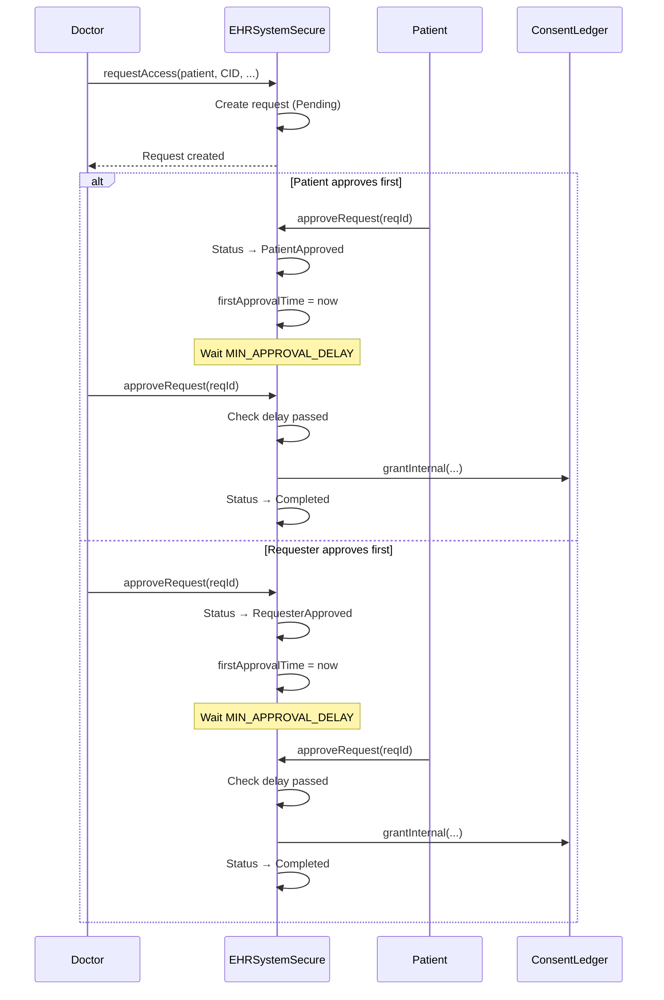

# EHRSystemSecure Contract - 2-Step Approval System

## 📋 Mục Lục
1. [Tổng Quan](#tổng-quan)
2. [Quá Trình Tư Duy Thiết Kế](#quá-trình-tư-duy-thiết-kế)
3. [2-Step Approval Flow](#2-step-approval-flow)
4. [Implementation Chi Tiết](#implementation-chi-tiết)
5. [Testing Strategy](#testing-strategy)

---

## Tổng Quan

### Vai Trò Trong Hệ Thống
`EHRSystemSecure.sol` cung cấp:
- ✅ Request access system (DirectAccess / FullDelegation)
- ✅ 2-step approval với time delay (security)
- ✅ Reject request mechanism
- ✅ Pause/unpause functionality

### Tại Sao Cần 2-Step Approval?

**❌ 1-Step Approval (Insecure):**
```
Doctor requests → Patient approves → Instant access
                                     ↑
                                     Phishing risk!
```

**✅ 2-Step Approval (Secure):**
```
Doctor requests → Patient approves → Wait 1 minute → Doctor confirms → Access granted
                                     ↑
                                     Time to detect phishing!
```

**Benefits:**
- Patient có thời gian review request
- Detect & reject phishing attempts
- Doctor phải confirm (prevent accidental approvals)

---

## Quá Trình Tư Duy Thiết Kế

### Bước 1: Xác Định Request Types

#### DirectAccess
```
Doctor → Request access to specific record
Patient → Approve
Doctor → Confirm
→ Doctor gets access to that record
```

**Use case:** Doctor cần xem specific medical record

#### FullDelegation
```
Organization → Request delegation authority
Patient → Approve
Organization → Confirm
→ Organization can grant access on behalf of patient
```

**Use case:** Hospital cần quyền quản lý records cho patient

### Bước 2: State Machine Design

```solidity
enum RequestStatus {
    Pending,            // Initial state
    RequesterApproved,  // Requester approved first
    PatientApproved,    // Patient approved first
    Completed,          // Both approved, access granted
    Rejected            // Rejected by either party
}
```

**State Transitions:**
```
Pending
  ├─→ RequesterApproved (requester approves)
  │     └─→ Completed (patient approves after delay)
  ├─→ PatientApproved (patient approves)
  │     └─→ Completed (requester approves after delay)
  └─→ Rejected (either party rejects)
```

### Bước 3: Security Constants

```solidity
uint40 public constant MIN_APPROVAL_DELAY = 1 minutes;
uint40 public constant MAX_REQUEST_VALIDITY = 30 days;
uint40 public constant DEFAULT_CONSENT_DURATION = 90 days;
uint40 public constant MAX_DELEGATION_DURATION = 365 days;
```

**Tư duy:**
- `MIN_APPROVAL_DELAY`: 1 minute (balance security vs UX)
- `MAX_REQUEST_VALIDITY`: 30 days (requests expire)
- `DEFAULT_CONSENT_DURATION`: 90 days (reasonable for treatment)
- `MAX_DELEGATION_DURATION`: 1 year (long-term care)

---

## 2-Step Approval Flow

### Flow Diagram



### Key Security Features

1. **Time Delay**: Minimum 1 minute between approvals
2. **Nonce-Based IDs**: Prevent replay attacks
3. **Expiry**: Requests expire after validity period
4. **Pausable**: Admin can pause in emergency

---

## Implementation Chi Tiết

### 1. Request Access

```solidity
function requestAccess(
    address patient,
    string calldata rootCID,
    RequestType reqType,
    bytes32 encKeyHash,
    uint40 consentDurationHours,
    uint40 validForHours
) external whenNotPaused nonReentrant {
    // 1. Validate parties
    if (msg.sender == patient || patient == address(0)) {
        revert InvalidRequest();
    }
    if (!accessControl.isPatient(patient)) revert InvalidRequest();

    // 2. Validate validity period (allow 0 for default)
    if (validForHours > MAX_REQUEST_VALIDITY / 1 hours) {
        revert InvalidRequest();
    }
    
    // Use default if 0
    if (validForHours == 0) {
        validForHours = 7 * 24; // 7 days
    }

    // 3. Validate based on request type
    if (reqType == RequestType.DirectAccess) {
        // Direct access: doctor/org requests patient's record
        if (bytes(rootCID).length == 0) revert InvalidRequest();
        if (encKeyHash == bytes32(0)) revert InvalidRequest();
        
        bool isDoctor = accessControl.isDoctor(msg.sender);
        bool isOrg = accessControl.isOrganization(msg.sender);
        if (!isDoctor && !isOrg) revert InvalidRequest();
        
    } else {
        // Full delegation: doctor/org requests delegation authority
        bool isDoctor = accessControl.isDoctor(msg.sender);
        bool isOrg = accessControl.isOrganization(msg.sender);
        if (!isDoctor && !isOrg) revert InvalidRequest();
    }

    // 4. Generate unique request ID with nonce
    bytes32 reqId = keccak256(abi.encode(
        msg.sender,
        patient,
        rootCID,
        reqType,
        _requestNonce++
    ));

    // 5. Calculate durations
    uint40 validityWindow = validForHours * 1 hours;
    uint40 expiry = uint40(block.timestamp) + validityWindow;
    
    uint40 consentDuration;
    if (consentDurationHours == 0) {
        consentDuration = reqType == RequestType.DirectAccess 
            ? DEFAULT_CONSENT_DURATION 
            : MAX_DELEGATION_DURATION;
    } else {
        consentDuration = consentDurationHours * 1 hours;
        
        uint40 maxDuration = reqType == RequestType.DirectAccess 
            ? 365 days 
            : MAX_DELEGATION_DURATION;
        
        if (consentDuration > maxDuration) revert InvalidDuration();
    }

    // 6. Store request
    _accessRequests[reqId] = AccessRequest({
        requester: msg.sender,
        patient: patient,
        rootCID: rootCID,
        encKeyHash: encKeyHash,
        reqType: reqType,
        expiry: expiry,
        consentDuration: consentDuration,
        firstApprovalTime: 0,
        status: RequestStatus.Pending
    });

    // 7. Emit event
    emit AccessRequested(
        reqId,
        msg.sender,
        patient,
        rootCID,
        reqType,
        expiry
    );
}
```

**Tư duy:**
1. ✅ Validate all inputs
2. ✅ Apply defaults (validForHours, consentDuration)
3. ✅ Generate nonce-based ID (prevent replay)
4. ✅ Calculate expiry times
5. ✅ Store request
6. ✅ Emit event

### 2. Approve Request (2-Step Logic)

```solidity
function approveRequest(bytes32 reqId) 
    external whenNotPaused nonReentrant 
{
    AccessRequest storage req = _accessRequests[reqId];
    
    // 1. Validate request
    _requireValidRequest(req);

    // 2. Check if caller is a party
    bool isRequester = msg.sender == req.requester;
    bool isPatient = msg.sender == req.patient;
    
    if (!isRequester && !isPatient) revert NotParty();

    RequestStatus currentStatus = req.status;
    uint40 now40 = uint40(block.timestamp);

    // 3. Handle first approval
    if (currentStatus == RequestStatus.Pending) {
        if (isRequester) {
            req.status = RequestStatus.RequesterApproved;
            req.firstApprovalTime = now40;
            emit RequestApprovedByRequester(reqId, msg.sender, now40);
        } else {
            req.status = RequestStatus.PatientApproved;
            req.firstApprovalTime = now40;
            emit RequestApprovedByPatient(reqId, msg.sender, now40);
        }
        return;
    }

    // 4. Handle second approval
    bool canComplete = false;
    
    if (currentStatus == RequestStatus.RequesterApproved && isPatient) {
        canComplete = true;
    } else if (currentStatus == RequestStatus.PatientApproved && isRequester) {
        canComplete = true;
    }

    if (!canComplete) revert AlreadyProcessed();

    // 5. Check approval delay (SECURITY!)
    if (now40 < req.firstApprovalTime + MIN_APPROVAL_DELAY) {
        revert ApprovalTooSoon();
    }

    // 6. Complete request
    _completeRequest(reqId, req);
}
```

**Tư duy:**
1. ✅ Validate request exists & not expired
2. ✅ Check caller is party (requester or patient)
3. ✅ First approval: Set status & timestamp
4. ✅ Second approval: Check delay passed
5. ✅ Complete request

**CRITICAL: Time Delay Check**
```solidity
// ❌ WRONG: No delay check
if (currentStatus == PatientApproved && isRequester) {
    _completeRequest(reqId, req);  // Instant!
}

// ✅ CORRECT: Check delay
if (now40 < req.firstApprovalTime + MIN_APPROVAL_DELAY) {
    revert ApprovalTooSoon();  // Must wait!
}
_completeRequest(reqId, req);
```

### 3. Complete Request (Internal)

```solidity
function _completeRequest(bytes32 reqId, AccessRequest storage req) internal {
    // 1. Mark as completed
    req.status = RequestStatus.Completed;
    
    // 2. Calculate consent expiry
    uint40 expireAt = uint40(block.timestamp) + req.consentDuration;
    
    // 3. Grant access based on type
    if (req.reqType == RequestType.DirectAccess) {
        // Grant access to specific record
        consentLedger.grantInternal(
            req.patient,
            req.requester,
            req.rootCID,
            req.encKeyHash,
            expireAt,
            false,  // includeUpdates
            false   // allowDelegate
        );
    } else {
        // Grant delegation authority
        consentLedger.grantDelegationInternal(
            req.patient,
            req.requester,
            req.consentDuration,
            false   // allowSubDelegate
        );
    }
    
    // 4. Emit event
    emit RequestCompleted(
        reqId,
        req.requester,
        req.patient,
        req.reqType
    );
}
```

### 4. Reject Request

```solidity
function rejectRequest(bytes32 reqId) external whenNotPaused nonReentrant {
    AccessRequest storage req = _accessRequests[reqId];
    
    // 1. Validate request
    _requireValidRequest(req);
    
    // 2. Check caller is party
    bool isRequester = msg.sender == req.requester;
    bool isPatient = msg.sender == req.patient;
    
    if (!isRequester && !isPatient) revert InvalidRequest();
    
    // 3. Mark as rejected
    req.status = RequestStatus.Rejected;
    
    // 4. Emit event
    emit RequestRejected(reqId, msg.sender, uint40(block.timestamp));
}
```

**Tư duy:**
- Either party có thể reject
- Reject ở bất kỳ stage nào (Pending, Approved)
- Không thể reject sau khi Completed

---

## Testing Strategy

### Test Categories

#### 1. Request Access Tests

```solidity
function test_RequestAccess_DirectAccess_Success() public {
    vm.prank(doctor1);
    ehrSystem.requestAccess(
        patient1,
        CID_1,
        EHRSystemSecure.RequestType.DirectAccess,
        ENC_KEY,
        0,  // Use default consent duration
        0   // Use default validity
    );
    
    bytes32 reqId = _getRequestId(doctor1, patient1, CID_1, 0);
    
    EHRSystemSecure.AccessRequest memory req = ehrSystem.getAccessRequest(reqId);
    assertEq(uint8(req.status), uint8(EHRSystemSecure.RequestStatus.Pending));
}

function test_RequestAccess_RevertWhen_SelfRequest() public {
    vm.expectRevert(EHRSystemSecure.InvalidRequest.selector);
    vm.prank(patient1);
    ehrSystem.requestAccess(
        patient1,  // Self!
        CID_1,
        EHRSystemSecure.RequestType.DirectAccess,
        ENC_KEY,
        0, 0
    );
}

function test_RequestAccess_RevertWhen_NotDoctor() public {
    vm.expectRevert(EHRSystemSecure.InvalidRequest.selector);
    vm.prank(attacker);
    ehrSystem.requestAccess(
        patient1,
        CID_1,
        EHRSystemSecure.RequestType.DirectAccess,
        ENC_KEY,
        0, 0
    );
}
```

#### 2. 2-Step Approval Tests

```solidity
function test_ApproveRequest_TwoStepFlow_Success() public {
    // Create request
    vm.prank(doctor1);
    ehrSystem.requestAccess(patient1, CID_1, ...);
    
    bytes32 reqId = _getRequestId(...);
    
    // Patient approves first
    vm.prank(patient1);
    ehrSystem.approveRequest(reqId);
    
    // Verify status
    EHRSystemSecure.AccessRequest memory req = ehrSystem.getAccessRequest(reqId);
    assertEq(uint8(req.status), uint8(EHRSystemSecure.RequestStatus.PatientApproved));
    
    // Wait for delay
    vm.warp(block.timestamp + 1 minutes + 1);
    
    // Doctor confirms
    vm.prank(doctor1);
    ehrSystem.approveRequest(reqId);
    
    // Verify completed
    req = ehrSystem.getAccessRequest(reqId);
    assertEq(uint8(req.status), uint8(EHRSystemSecure.RequestStatus.Completed));
    
    // Verify access granted
    assertTrue(consentLedger.canAccess(patient1, doctor1, CID_1));
}

function test_ApproveRequest_RequesterFirst_Success() public {
    vm.prank(doctor1);
    ehrSystem.requestAccess(patient1, CID_1, ...);
    
    bytes32 reqId = _getRequestId(...);
    
    // Requester approves first
    vm.prank(doctor1);
    ehrSystem.approveRequest(reqId);
    
    // Patient approves second
    vm.prank(patient1);
    ehrSystem.approveRequest(reqId);
    
    // Wait for delay
    vm.warp(block.timestamp + 1 minutes + 1);
    
    // Requester confirms
    vm.prank(doctor1);
    ehrSystem.approveRequest(reqId);
    
    assertTrue(consentLedger.canAccess(patient1, doctor1, CID_1));
}

function test_ApproveRequest_RevertWhen_ApprovalTooSoon() public {
    vm.prank(doctor1);
    ehrSystem.requestAccess(patient1, CID_1, ...);
    
    bytes32 reqId = _getRequestId(...);
    
    // Patient approves
    vm.prank(patient1);
    ehrSystem.approveRequest(reqId);
    
    // Try to complete immediately (no delay!)
    vm.expectRevert(EHRSystemSecure.ApprovalTooSoon.selector);
    vm.prank(doctor1);
    ehrSystem.approveRequest(reqId);
}
```

#### 3. Reject Tests

```solidity
function test_RejectRequest_ByPatient_Success() public {
    vm.prank(doctor1);
    ehrSystem.requestAccess(patient1, CID_1, ...);
    
    bytes32 reqId = _getRequestId(...);
    
    // Patient rejects
    vm.prank(patient1);
    ehrSystem.rejectRequest(reqId);
    
    // Verify rejected
    EHRSystemSecure.AccessRequest memory req = ehrSystem.getAccessRequest(reqId);
    assertEq(uint8(req.status), uint8(EHRSystemSecure.RequestStatus.Rejected));
    
    // Verify no access
    assertFalse(consentLedger.canAccess(patient1, doctor1, CID_1));
}

function test_RejectRequest_RevertWhen_Unauthorized() public {
    vm.prank(doctor1);
    ehrSystem.requestAccess(patient1, CID_1, ...);
    
    bytes32 reqId = _getRequestId(...);
    
    vm.expectRevert(EHRSystemSecure.InvalidRequest.selector);
    vm.prank(attacker);
    ehrSystem.rejectRequest(reqId);
}
```

#### 4. Edge Cases

```solidity
function test_ApproveRequest_RevertWhen_RequestExpired() public {
    vm.prank(doctor1);
    ehrSystem.requestAccess(
        patient1, CID_1, ...,
        0,
        24  // 24 hours validity
    );
    
    bytes32 reqId = _getRequestId(...);
    
    // Warp past expiry
    vm.warp(block.timestamp + 25 hours);
    
    vm.expectRevert(EHRSystemSecure.RequestExpired.selector);
    vm.prank(patient1);
    ehrSystem.approveRequest(reqId);
}

function test_EdgeCase_MultipleRequests_SamePatient() public {
    // Doctor can have multiple pending requests
    vm.startPrank(doctor1);
    ehrSystem.requestAccess(patient1, CID_1, ...);
    ehrSystem.requestAccess(patient1, CID_2, ...);
    vm.stopPrank();
    
    // Each has unique ID (nonce-based)
    bytes32 reqId1 = _getRequestId(doctor1, patient1, CID_1, 0);
    bytes32 reqId2 = _getRequestId(doctor1, patient1, CID_2, 1);
    
    assertTrue(reqId1 != reqId2);
}
```

---

## Common Pitfalls & Solutions

### ❌ Pitfall 1: No Time Delay

```solidity
// WRONG: Instant approval
if (currentStatus == PatientApproved && isRequester) {
    _completeRequest(reqId, req);  // Phishing risk!
}

// CORRECT: Check delay
if (now40 < req.firstApprovalTime + MIN_APPROVAL_DELAY) {
    revert ApprovalTooSoon();
}
_completeRequest(reqId, req);
```

### ❌ Pitfall 2: Allow validForHours = 0 Without Default

```solidity
// WRONG: Revert on 0
if (validForHours == 0) revert InvalidRequest();

// CORRECT: Use default
if (validForHours == 0) {
    validForHours = 7 * 24;  // 7 days default
}
```

### ❌ Pitfall 3: Not Using Nonce for Request ID

```solidity
// WRONG: Predictable ID
bytes32 reqId = keccak256(abi.encode(
    msg.sender,
    patient,
    rootCID,
    reqType
    // Missing nonce! Can replay!
));

// CORRECT: Include nonce
bytes32 reqId = keccak256(abi.encode(
    msg.sender,
    patient,
    rootCID,
    reqType,
    _requestNonce++  // Unique!
));
```

---

## Kết Luận

### Key Takeaways

1. **2-Step Approval**: Security > UX (but balance with 1 min delay)
2. **Time Delay**: Critical for detecting phishing
3. **Nonce-Based IDs**: Prevent replay attacks
4. **Expiry**: Requests don't live forever
5. **Pausable**: Emergency stop mechanism

### Security Checklist

- [ ] Check MIN_APPROVAL_DELAY passed
- [ ] Use nonce for request IDs
- [ ] Validate request not expired
- [ ] Check caller is party (requester or patient)
- [ ] Emit events for all state changes
- [ ] Test both approval orders (patient first, requester first)

### Next Steps

1. ✅ Integration testing với all contracts
2. ✅ Deploy to testnet
3. ✅ Monitor approval delays in production

**Happy Coding! 🚀**
